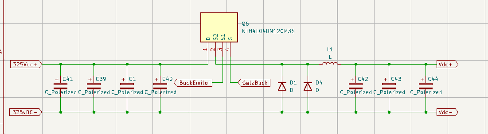
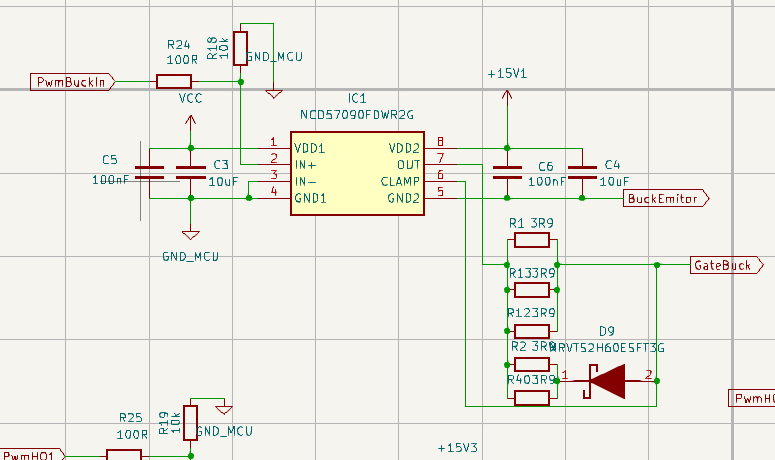
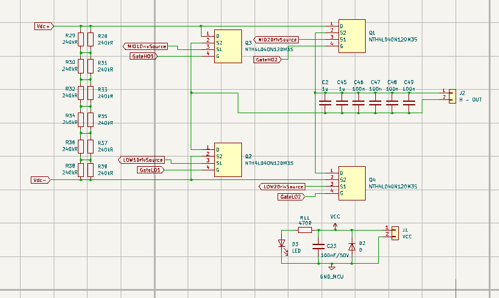

# STM32 Induction Furnace

A personal project focused on designing and building a resonant H-bridge induction furnace controlled by an STM32 microcontroller.

This was my first larger electronics project and gave me hands-on experience with power electronics, control systems, PCB design, and embedded software development.

The furnace was not completed as a final product, but core functionality was successfully tested. Maximum achieved temperature reached the Curie point.

# Challenges
Learning the fundamentals of power electronics.
Understanding resonant circuits and H-bridge operation.
Designing reliable gate driver circuits.
Managing electrical noise and ground isolation.
Debugging hardware and software interactions.
Developing and tuning control algorithms.

# Lessons Learned

Through this project, I gained practical experience in:

Power electronics design.
Designing power supplies with multiple voltage levels.
STM32 development using STM32CubeIDE.
Implementing control algorithms for an H-bridge inverter.
Applying Ohm's Law and basic circuit analysis in real-world situations.
Reading and understanding component datasheets.
PCB design, including gate driver layout and ground isolation.
Using laboratory equipment such as oscilloscopes and multimeters.
System debugging and troubleshooting.

## PCB Design

## Schematic

## Assebled PCB

# Future Improvements

If I were to redesign the system today, I would:

Improve thermal management and cooling.
Reconsider the overall system architecture.
Spend more time on mathematical analysis before implementation.
Perform more simulations and design reviews early in development.
Add additional protection features and fault detection mechanisms.
Improve PCB layout to reduce noise and simplify debugging.
